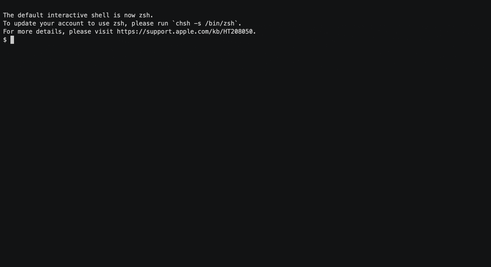
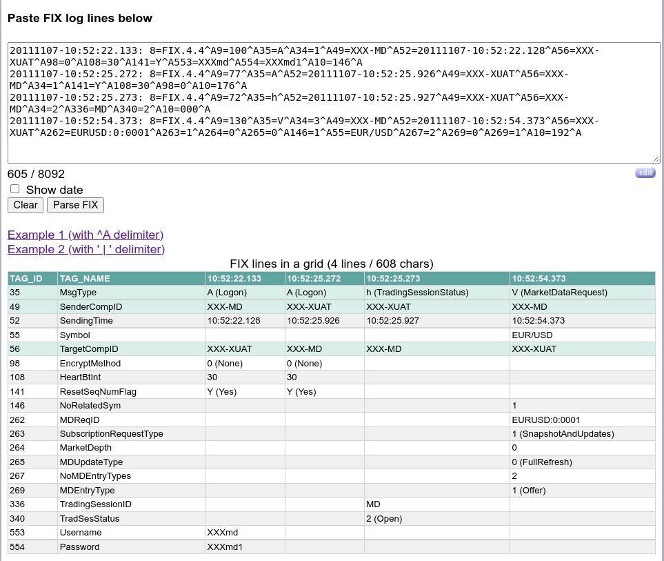

# FIXations!
## A set of tools to handle FIX protocol data
 - **fix_tags** - _explore FIX tags and their associated values either as CLI output or a GUI-like textual interface_
 - **fix_parse_log** - _extract FIX lines from a (log) file and present them in a nicely formatted grid_
 - **webfix** - _present copy-n-paste'd FIX lines into a nicely formatted grid_

### Installation
`pip3 install fixations`

### Examples of running these applications
#### fix_tags
_Click on the link below since it was too small to asciicast in this page_
[](https://asciinema.org/a/551910?autoplay=1&t=2)

#### fix_parse_log


#### webfix
Webfix needs to be used with either Flask (for dev purposes) 
```commandline
$ python -m flask --app fixations.webfix run
 * Serving Flask app 'fixations.webfix'
 * Debug mode: off
WARNING: This is a development server. Do not use it in a production deployment. 
Use a production WSGI server instead.
 * Running on http://127.0.0.1:5000
Press CTRL+C to quit
```

or something like gunicorn (or other WSGI servers) for production uses:
```commandline
$ gunicorn fixations.wsgi:app
[2023-01-16 19:55:31 -0500] [3380019] [INFO] Starting gunicorn 20.1.0
[2023-01-16 19:55:31 -0500] [3380019] [INFO] Listening at: http://127.0.0.1:8000 (3380019)
[2023-01-16 19:55:31 -0500] [3380019] [INFO] Using worker: sync
[2023-01-16 19:55:31 -0500] [3380028] [INFO] Booting worker with pid: 3380028
```




## FIX reference data source
The data is extracted from the FIX specs available here: 

> https://www.fixtrading.org/packages/fix-repository-2010/ 
(see fix_repository_2010_edition_20200402.zip).

NOTE: it requires the creation of a login/password to access it.

### Updating the FIX references
Every so often the https://www.fixtrading.org website will issue an *extension pack*, i.e. an update to their FIX reference for FIX 5.0SP2

The list of *extension packs* can be found here
> https://www.fixtrading.org/extension-packs/

That's where one can find a pointer to an EP download button that points to something like:
> https://www.fixtrading.org/packages/ep287/

Within it, one needs to download the matching ZIP file:
> FIXBasicRepository_FIX.Latest_EP287.zip

Which can be unzip to reveal a directory called *Basic* which contains the same XML file **Fixations** requires:
```commandline
unzip -v FIXBasicRepository_FIX.Latest_EP287.zip | grep Basic |grep xml
   78310  Defl:N     8753  89% 02-06-2024 10:32 579086ea  Basic/Abbreviations.xml
   12902  Defl:N     1432  89% 02-06-2024 10:32 719a08e3  Basic/Categories.xml
  395051  Defl:N    36228  91% 02-06-2024 10:32 1936d9af  Basic/Components.xml
   33163  Defl:N     5675  83% 02-06-2024 10:32 7efbdd59  Basic/Datatypes.xml
 1554894  Defl:N   194377  88% 02-06-2024 10:34 4def9e3d  Basic/Enums.xml
 2269559  Defl:N   266814  88% 02-06-2024 10:32 7fe17774  Basic/Fields.xml
 8187931  Defl:N   745380  91% 02-06-2024 10:34 75dc5b17  Basic/IntermediateRepository.xml
  105161  Defl:N    17924  83% 02-06-2024 10:32 348735e8  Basic/Messages.xml
 3144399  Defl:N   213711  93% 02-06-2024 10:32 8c5d516a  Basic/MsgContents.xml
    2230  Defl:N      739  67% 02-06-2024 10:32 e6dc9b4e  Basic/Sections.xml
```
You need to `cp` those files into `fixations/fix_repository_2010_edition_20200402/FIX.5.0SP2/Base`. Note the `Base` vs `Basic` directory.

Note: I will try to keep an eye on new *extension packs* and update this repo accordingly

## TODO:
 1. create a hyperlink to FIX specs for each tag based on FIX version :white_check_mark:
 2. add more info to README.md. Use rule80A and 47 as example for fix_args :white_check_mark:
 3. add more example(s)
 4. add some pytest to detect the FIX version for example :white_check_mark:
 5. add "direction" to columns to show whether it's a request or a response
 6. catch exceptions and display them on the webpage
 7. deploy to https://vercel.com/
 8. allow creating an ASCII table equivalent suitable to be cut-n-paste into a document for example
 9. add a short link ala tinyurl and save it into a sqlite3 db store :white_check_mark:
 10. black theme?
 11. allow to have no leading timestamp and use the timestamp FIX tags instead :white_check_mark:
 12. add proper Logger
 13. add DB stats
 14. pypi.org can't display the ASCII screencast images. Need to reference GitHub's full path?
 15. Give the option to remove or hide/obfuscate some sensitive fields such as tag55 or senderCompId/targetComPid :white_check_mark:
 16. Show the delta between each timestamp (below each timestamp) :white_check_mark:
 17. Transpose the grid/matrix :white_check_mark:
 18. Shift-Enter = pressing on [Parse FIX] button :white_check_mark:
 19. Support FIX Repeating Groups :white_check_mark:
 20. When using fix_parse_log.py, also upload the same data to the webfix app to generate a tiny URL :white_check_mark: 
 21. Add an option to sort the entries by log timestamp. Useful when grep over multiple files
 22. Add smart comments when comments aren't provided, based on simple rules on tags: 35=D and 8002=1 then comment="blah"
 23. Add top tags to the ASCII version


